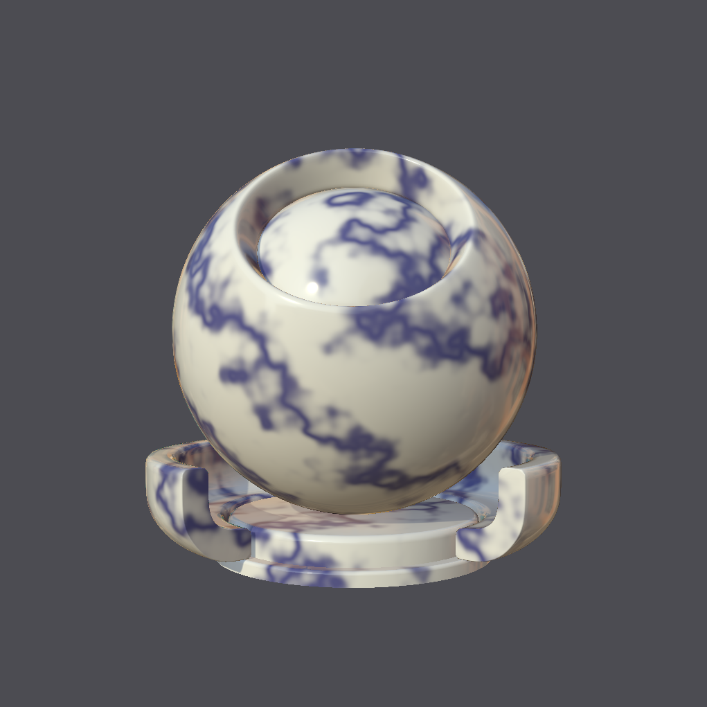
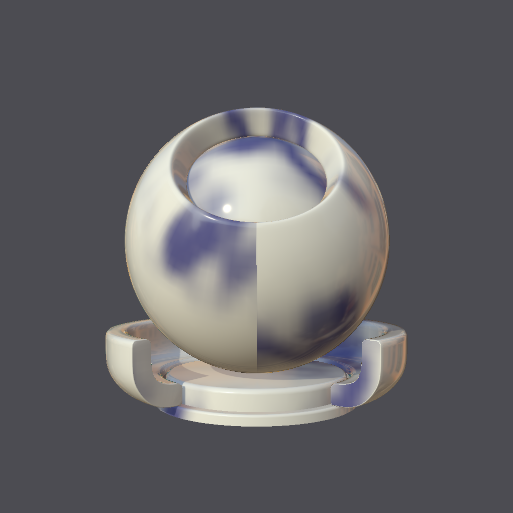
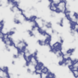
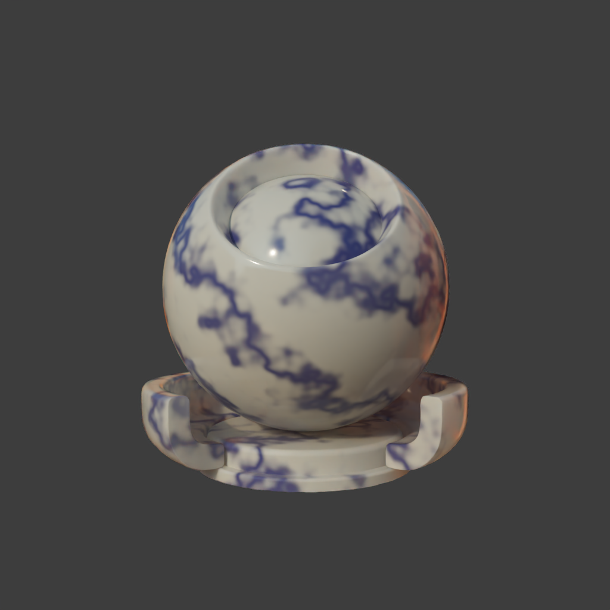
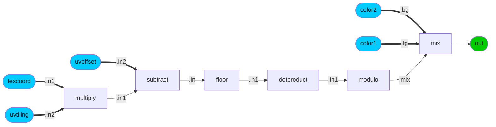
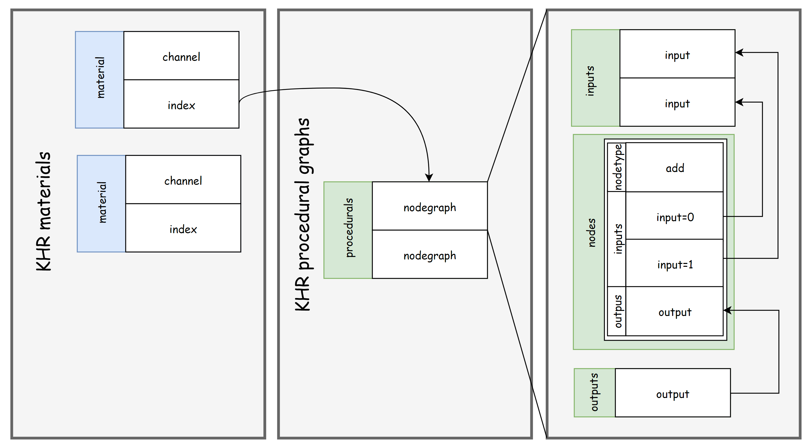
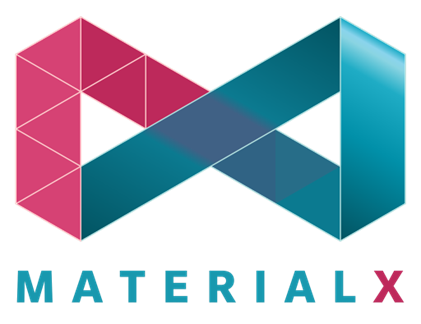

# Introduction

The Khronos glTF PBR material defines a real-time shading model for real-world application. The inputs that can be mapped to this model are currently restricted to 2d images.

The proposed texture procedurals extension (<a href="https://github.com/KhronosGroup/glTF/tree/KHR_texture_procedurals/extensions/2.0/Khronos/KHR_texture_procedurals">KHR_texture_procedurals</a>) 
provides the ability to extend this by allowing for the representation of shading graphs (procedural graphs) 
and the ability to connect these to existing glTF PBR material inputs. 

## Properties

This allows for the following properties:

### Increased flexibility and fidelity

Graphs no longer need to be "baked" into 2d images. For instance this allows for any 3d positional dependent graphs such as a 3d texture, or a view dependent pattern to be defined.

Figure: Shows a material mapped with a 3d marble. The results of simple baking are shown on the right along with the baked image. Fidelity and 3d placement information may be lost. Flexibility to adjust and animate the pattern without re-baking at run-time is also list.

<table>
<tr>
<td>

<td>

<td>

</tr>
</table>

### Lossless Interoperability

Nodes and graphs are defined adhere to the schema provided by MaterialX which either exactly or
closely matches the OpenUSD schema for shading graphs. As both use the exact same logic the rendered results are predictable and 
reproducible.

Figure: Shows the same material which was converted from glTF to MaterialX and then imported into OpenUSD for rendering.
<table>
<tr>
<td>

</tr>
</table>

Storage is in JSON format allowing for run-time properties not afforded to by the existing MaterialX XML format. 

### Separability and Incremental Adoption

Procedural graph content can be stored independently from other glTF content as bindings
are specified external to the procedural descriptions.
This separability and the fact that the extension can be added incrementally
allow for procedural support to be added incrementally to existing or new content in a non-destructive manner.

## Composition

Procedurals are specified as acyclic graphs of nodes which provide the computation logic.

The results can be routed to one or more outputs nodes. The input interface to the graph can be specified by one or more input nodes which map to graph node inputs.

Figure: Below is an example procedural graph, with interface inputs in blue and outputs in green.

One or more of these graphs may be stored in a glTF document with one or more of the outputs from these graphs connected to downstream glTF PBR materials. Geometric streams and textures may be bound to interface inputs on node graphs. Interface inputs may also have animation bound as applicable.

Figure: An example of the JSON structure is shown below. From right to left is: A procedural graph with two inputs and one output; a list of procedurals graphs containing two graphs; a reference to a given procedural graph from a material.

## Standardization / Interoperability

<table>
<tr>
<td>
<td>
</tr>
</table>

A second extension (<a href="https://github.com/KhronosGroup/glTF/tree/KHR_texture_procedurals/extensions/2.0/Vendor/EXT_texture_procedurals_mx_1_39">EXT_texture_procedurals_mx_1_39</a>) specifies that node definitions (schema) are defined by MaterialX with the target
release being 1.39.

A <a href="https://github.com/KhronosGroup/glTF-MaterialX-Converter">new tooling repository</a> allows for the bi-directional conversion of procedural graphs (and their associated material bindings)  
between MaterialX XML and glTF JSON.

The supported configurations include:

1. Graph nodes which are defined by the "standard library" for the target MaterialX release. This includes
nodes defining basic math, 
2. glTF PBR and unlit shader nodes as defined in MaterialX and glTF.

This allows for lossless interchange to and from MaterialX and hence the possibility for lossless interchange of graphs between glTF and OpenUSD, or other integrations which use MaterialX as the interchange format for materials.

The logic is provided as a Python library which can packaged and integrated as desired. 

A series of sample content has been provided as part of a test suite with reference renderings provided. Below are a few samples.

<table>
<tr>
<th>Properties
<th>glTF Procedural Graph
<th>Reference Render
<tr>
<td>This graph contains nodes to produce a checkerboard pattern.

<td>
<td>
<tr>
<td>This graph contains a reference to a file texture used to map to base color. This graph is a simplified version of the glTF BoomBox sample which ships with the MaterialX distribution.

<td>
<td>
</table>

